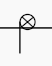

| Nota (baixo)                                                                     | Nota (cima)                                                                     | Descrição     |
| -------------------------------------------------------------------------------- | ------------------------------------------------------------------------------- | ------------- |
|          |          | Grave         |
|  |  | Grave abafado |
|      |      | Platinela     |
|           |           | Tapa          |
|     |     | Grave seco    |

| Símbolo                                                                     | Descrição      |
| --------------------------------------------------------------------------- | -------------- |
|          | Acento         |
|  | Toque bem leve |
