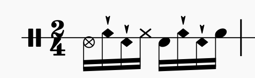
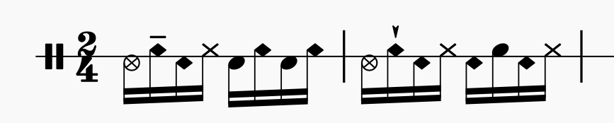
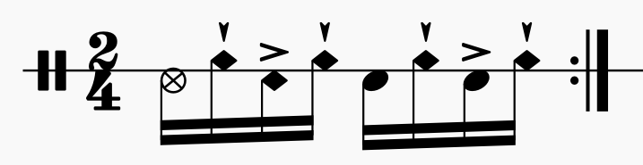
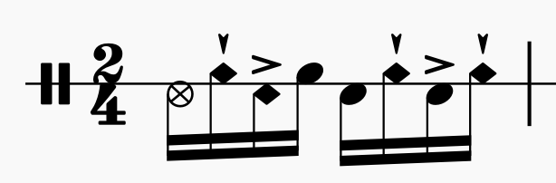

# Levadas

## Samba-choro

### Sotaque - Surdo

### Sotaque - Bossa Nova

### Sotaque - Dançando com notas que deviam ser fantasma

### Sotaque - Tantan
__OBS.: notas fantasma bem leves__

### Sotaque - Repique de mão

## Sotaque - Repique de anel

### Variação 1

### Variação 2

### Variação 3

## Baião
__OBS.: notas fantasma bem leves; contraste maior entre acentos e notas fantasma__

## Xote
__OBS.: notas fantasma bem leves; contraste maior entre acentos e notas fantasma__

### Variação 1

## Forró

## Ijexá

### Viradinha 1

### Viradinha 2

### Viradinha 3

## Maracatu

### Variação 1

