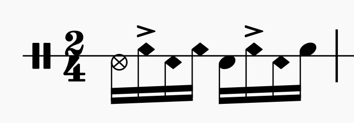
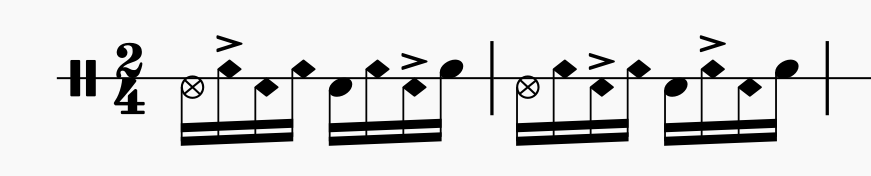
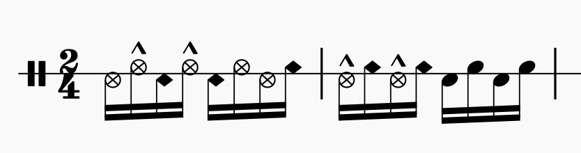
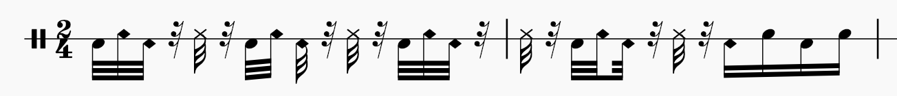
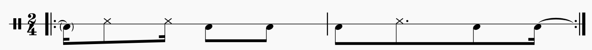
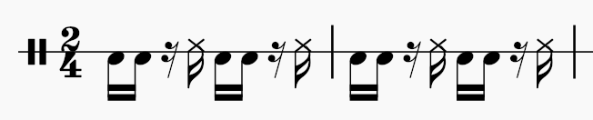
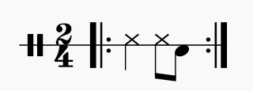
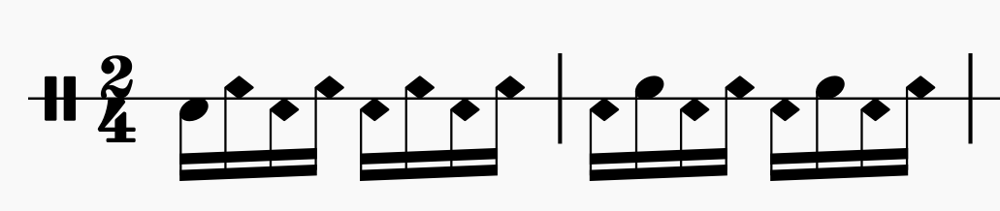
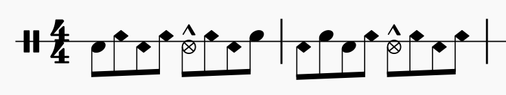
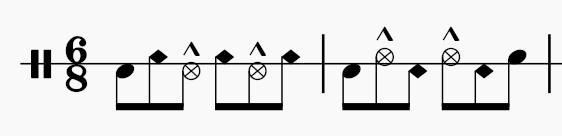

# Levadas

## Samba-choro

### Sotaque - Surdo

### Sotaque - Bossa Nova

### Sotaque - Dançando com notas que deviam ser fantasma

### Sotaque - Tantan

**OBS.: notas fantasma bem leves**

### Sotaque - Repique de mão

### Sotaque - Repique de anel

### Virada 1

### Virada 2

### Virada 3

### Virada 4

## Partido alto

### Partido Preguiçoso

#### Variação 1

#### Variação 2

#### Variação 3

### Virada 1

### Virada 2

## Samba de roda

Mesma mecânica do forró.

## Baião

**OBS.: notas fantasma bem leves; contraste maior entre acentos e notas fantasma**

## Xote

**OBS.: notas fantasma bem leves; contraste maior entre acentos e notas fantasma**

### Variação 1

## Forró

## Arrasta-pé

### Variação 1

## Ijexá

### Variação 1

### Variação 2

### Variação 3

### Variação 4

### Viradinha 1

### Viradinha 2

### Viradinha 3

## Maracatu

### Variação 1

## Funk

### Variação 1

### Variação 2

### Variação 3

## Frevo
**OBS.: semicolcheias feitas usando o super rulo 3000 de Netinho Albuquerque**

### Suzanex

## Polca

# Aventuras

## Toques de origem Banta

### Padrão 1

### Padrão 2

### Padrão 3

## Funk anos 90 - Estrada da posse

